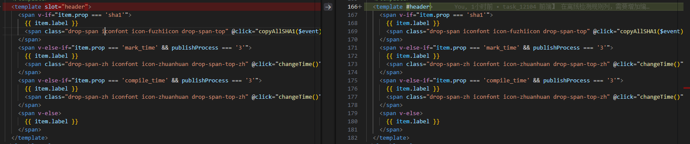

# 1.Element UI 动态表头不刷新问题

调试阶段发现切换单选框 修改 publishProcess 的值 在混合方法中定义的计算属性输出值正常 
在watch监听输出值正常 在表格数据中输出正常 但是在表头会出现偶尔 publishProcess 不更新的情况
(a)因此一开始选择重新渲染表格 给表格定义key 为0  切换时加1 发现可以正常切换
(b)将table组件库 slot="header" 改为 #header 可以实现
