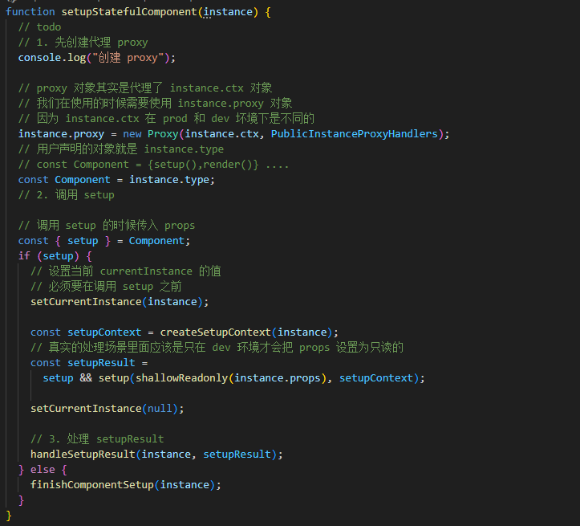

# vue3 Hellow world 渲染过程分析
1. 调用createAppAPI(render)函数创建一个app对象，并返回

(1)调用createVNode函数创建一个虚拟dom

虚拟dom的实质 :
const vnode = {
    el: null,
    component: null,
    key: props?.key,
    type,
    props: props || {},
    children,
    shapeFlag: getShapeFlag(type),
};
(2)调用render函数渲染vnode

2. renderer.ts执行render函数
(1) 调用patch函数

A processText(n1, n2, container)

B processFragment(n1, n2, container)

C processComponent(n1, n2, container, parentComponent) //创建根组件实例:APP

D setupComponent(instance)

E setupStatefulComponent(instance) //创建proxy

F createSetupContext(instance) //初始化 setup context

3.effect.ts 创建 ReactiveEffect 对象
(1) 执行run

(2) 执行用户传入的fn